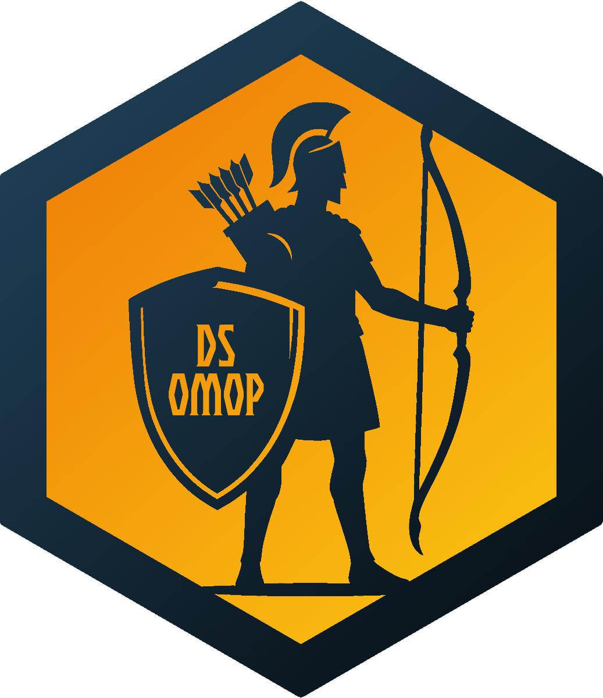
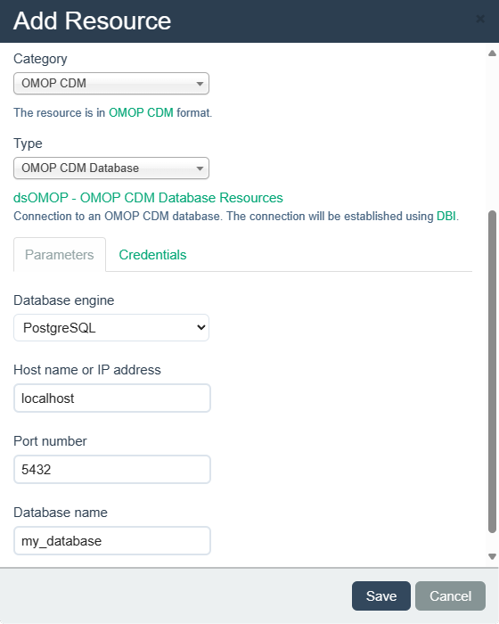

# dsOMOP 

## Introduction



The `dsOMOP` package is designed to facilitate the interaction with remote databases formatted in the [Observational Medical Outcomes Partnership (OMOP) Common Data Model (CDM)](https://www.ohdsi.org/data-standardization/) from within a [DataSHIELD](https://www.datashield.org/about/about-datashield-collated) environment. It provides a suite of functions that allow users to fetch and transform data from these databases into a format that is intelligible and usable within the DataSHIELD analytical workflow. This integration ensures that data analysis complies with the DataSHIELD security model, which is crucial for maintaining the privacy and security of the data.

Key features of the `dsOMOP` package include:
- **Data retrieval and transformation:** Functions to fetch data from OMOP CDM databases and transform it into a user-friendly table format.
- **Compliance with DataSHIELD security model:** Ensures that all data manipulations and analyses are performed in a way that adheres to the disclosure control measures set by DataSHIELD.
- **Support for database interaction:** Includes methods for checking database content (such as table, column and concept catalogs) and data filtering based on user-defined criteria. This enables researchers to tailor their data queries to specific research needs.

## Structure

The `dsOMOP` ecosystem comprises two essential components designed to work in tandem: the server-side package (`dsOMOP`) and the client-side package (`dsOMOPClient`). Each component plays a pivotal role in the integration of OMOP CDM databases within the DataSHIELD environment. For comprehensive details on installation, setup, and usage, please refer to the respective repositories:

- **Server-Side package `dsOMOP`**: This component is installed on the DataSHIELD server and is responsible for direct interactions with the OMOP CDM databases. It retrieves, transforms, and returns data in a format compatible with DataSHIELD's analytical tools. For code, installation instructions, and more, visit [https://github.com/isglobal-brge/dsOMOP](https://github.com/isglobal-brge/dsOMOP).

- **Client-Side package `dsOMOPClient`**: Utilized by researchers and data analysts, this package facilitates the communication with the `dsOMOP` package on the server. It sends data requests and receives processed data for analysis, ensuring a user-friendly experience for specifying data needs and analysis parameters. For code, installation instructions, and more, visit [https://github.com/isglobal-brge/dsOMOPClient](https://github.com/isglobal-brge/dsOMOPClient).

## Installation

To install the server-side package `dsOMOP`, follow the steps below. This guide assumes that you have administrative access to the DataSHIELD server and the necessary permissions to install R packages.

### Prerequisites

For the `dsOMOP` package to have access to the required data transformation features, it is essential that the privacy control level on the DataSHIELD server is set to either `permissive` or `banana`. This setting is crucial for performing operations that reshape tables into a wide format, which simplifies user interaction with the data.

This privacy control setting is managed by the server administrator. For more information on how to adjust this setting, please refer to the DataSHIELD documentation on disclosure checks at [https://wiki.datashield.org/en/statdev/disclosure-checks](https://wiki.datashield.org/en/statdev/disclosure-checks).

#### Changing privacy control level from the R console

If you are using an Opal server and have access to an administrator account, you can access the server's settings using the `opalr` package. If you do not have the `opalr` package installed, you can install it using the following command:
```
install.packages("opalr")
```

To create a login object for the server, change the following code to match your specific server details and administrator credentials:
```
library(opalr)

# Change the URL and credentials to match your Opal server and administrator account!
o <- opal.login(username = "administrator", password = "password", url = "https://opal-demo.obiba.org/")
```

To verify the server settings and ensure that the `privacyControlLevel` is set to either `permissive` or `banana`, you can use the following code. This will fetch the current privacy settings from the server and print them out:
```
dsadmin.get_options(o)
```

If the setting is not as required, you should then set the privacy control level to `permissive` using the following code:
```
dsadmin.set_option(o, "datashield.privacyControlLevel", "permissive")
```

### Package installation

If you prefer using a graphical user interface (GUI) provided by your server for package installation, you can easily install the `dsOMOP` package directly from GitHub. Navigate to the package installation section in your server's GUI, and specify the following details:

- **User/organization:** `isglobal-brge`
- **Package name:** `dsOMOP`
- **Git reference:** `main`

#### Installing from the R console

If you are using an Opal server and have access to an administrator account, you can install the package from the R console using the `opalr` package. If you do not have the `opalr` package installed, you can install it using the following command:
```
install.packages("opalr")
```

To create a login object for the server, change the following code to match your specific server details and administrator credentials:
```
library(opalr)

# Change the URL and credentials to match your Opal server and administrator account!
o <- opal.login(username = "administrator", password = "password", url = "https://opal-demo.obiba.org/")
```

You can then install the `dsOMOP` package using the following command:
```
dsadmin.install_github_package(o, 'dsOMOP', username='isglobal-brge')
```

## Creating OMOP CDM resources

The resources used by dsOMOP are of the type `omop.cdm.db`, which include the connection details to OMOP CDM databases.

These resources contain the following parameters:
- `driver`: The database engine used.
- `host`: The hostname or IP address of the database server.
- `port`: The port number on which the database server is listening.
- `db`: The name of the database.

To configure a resource for dsOMOP, ensure that you have the above details accurately filled out to establish a successful connection to your OMOP CDM database.

### Creating resources from GUI

dsOMOP modifies the interface provided by the Opal server to incorporate an option in its resource creation panel dedicated to OMOP CDM databases. This allows users to easily configure and manage resources specifically designed for OMOP CDM databases directly from the GUI.

To use it, simply access the management dashboard of a project and go to the `Resources` subsection. In the `Add Resource` option, you will find the `OMOP CDM` category:

<p align="center">
  
</p>

### Creating resources from the R console

If you are using an Opal server and have access to an administrator account, you can create the OMOP CDM resources from the R console using the `opalr` package. If you do not have the `opalr` package installed, you can install it using the following command:
```
install.packages("opalr")
```

To create a login object for the server, change the following code to match your specific server details and administrator credentials:
```
library(opalr)

# Change the URL and credentials to match your Opal server and administrator account!
o <- opal.login(username = "administrator", password = "password", url = "https://opal-demo.obiba.org/")
```

You can then use the following function to create an OMOP CDM resource:
```
driver <- "postgresql"
host <- "localhost"
port <- 5432
db_name <- "my_database"
username <- "my_username"
password <- "my_password"

opal.resource_create(o,
  project = "my_project",
  name = "my_resource",
  url = paste0(driver, "://", host, ":", port, "/", db_name),
  format = "omop.cdm.db", # It is very important that the format is set to omop.cdm.db!
  identity = username,
  secret = password
)
```

## Acknowledgements

- The development of dsOMOP has been supported by the **RadGen4COPD**, **[P4COPD](https://www.clinicbarcelona.org/en/projects-and-clinical-assays/detail/p4copd-prediction-prevention-personalized-and-precision-management-of-copd-in-young-adults)**, and **[DATOS-CAT](https://datos-cat.github.io/LandingPage)** projects. These collaborations have not only provided essential financial backing but have also affirmed the project's relevance and application in significant research endeavors.
- Funded by the **"Complementary Plan for Biotechnology Applied to Health"**, coordinated by the **[Institut de Bioenginyeria de Catalunya (IBEC)](https://ibecbarcelona.eu/)** within the framework of the **Recovery, Transformation, and Resilience Plan (C17.I1)** - Funded by the **European Union** - **[NextGenerationEU](https://next-generation-eu.europa.eu/index_en)**.
- Special thanks to **[Xavier Escribà-Montagut](https://github.com/ESCRI11)** for his invaluable support in the development process.

## Contact

For further information or inquiries, please contact:

- **Juan R González**: juanr.gonzalez@isglobal.org
- **David Sarrat González**: david.sarrat@isglobal.org

For more details about **DataSHIELD**, visit [https://www.datashield.org](https://www.datashield.org).

For more information about the **Barcelona Institute for Global Health (ISGlobal)**, visit [https://www.isglobal.org](https://www.isglobal.org).
