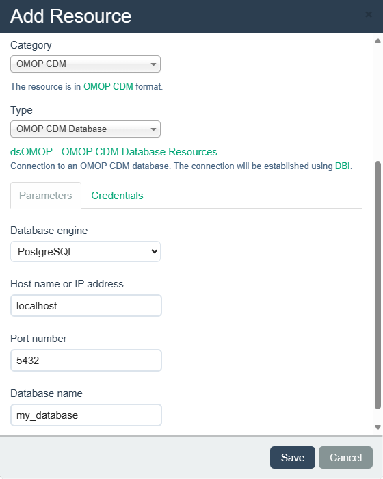

# dsOMOP

## Introduction


The `dsOMOP` package is designed to facilitate interaction with remote databases formatted in the [Observational Medical Outcomes Partnership (OMOP) Common Data Model (CDM)](https://www.ohdsi.org/data-standardization/) from within a [DataSHIELD](https://www.datashield.org/about/) environment. It provides reviewed, typed operations for fetching and transforming data into objects usable by server-side DataSHIELD analyses. Privacy depends on the deployed method allowlist, server options, database privileges and the contract of each operation; installing the package alone is not a blanket disclosure-safety guarantee.

Key features of the `dsOMOP` package include:

- **Typed extraction and transformation:** Reviewed plan, recipe and catalog
  operations for selected OMOP tables, filters and output grains. The package
  deliberately does not expose arbitrary client-authored SQL or joins.
- **DataSHIELD disclosure controls:** Applies distinct-person admission, small-cell suppression, count banding and server-owned policy checks on the reviewed routes that declare those contracts.
- **Support for database interaction:** Includes methods for inspecting table,
  column and concept catalogs and for filtering through typed, reviewed
  criteria. The available operations are intentionally narrower than the full
  relational capabilities of the underlying database.

## Structure

The `dsOMOP` ecosystem comprises two essential components designed to work in tandem: the server-side package (`dsOMOP`) and the client-side package (`dsOMOPClient`). Each component plays a pivotal role in the integration of OMOP CDM databases within the DataSHIELD environment. For comprehensive details on installation, setup, and usage, please refer to the respective repositories:

- **Server-Side package `dsOMOP`**: This component is installed on the DataSHIELD server and is responsible for direct interactions with the OMOP CDM databases. It retrieves and transforms data into protected server-side objects for explicitly reviewed DataSHIELD methods. For code, installation instructions, and more, visit [https://github.com/isglobal-brge/dsOMOP](https://github.com/isglobal-brge/dsOMOP).

- **Client-Side package `dsOMOPClient`**: Utilized by researchers and data analysts, this package facilitates the communication with the `dsOMOP` package on the server. It sends data requests and receives processed data for analysis, ensuring a user-friendly experience for specifying data needs and analysis parameters. For code, installation instructions, and more, visit [https://github.com/isglobal-brge/dsOMOPClient](https://github.com/isglobal-brge/dsOMOPClient).

## Installation

To install the server-side package `dsOMOP`, follow the steps below. This guide assumes that you have administrative access to the DataSHIELD server and the necessary permissions to install R packages.

### Prerequisites

Use the most restrictive DataSHIELD privacy-control level that supports the
reviewed methods deployed at your site. `dsOMOP` does **not** require the global
privacy level to be changed to `permissive` (or `banana`) for wide outputs.
Weakening that global setting would also affect unrelated DataSHIELD packages
and can invalidate the assumptions made by `dsOMOP`'s own controls.

The server administrator should instead:

- allowlist only the `dsOMOP` methods that have been reviewed for the local
  deployment;
- configure the DataSHIELD and `dsomop.*` thresholds through the installed
  package's `DESCRIPTION` fields or the server administration panel
  (`DATASHIELD` is the source-tree mirror and is not shipped in tarballs);
- give the ordinary analysis database identity read access to the CDM and only
  the minimum temporary-table permissions required by the selected backend;
- keep persistent cohort writes disabled unless a separately reviewed results
  schema and database role are configured.

### Persistent server identity

Set `DSOMOP_STATE_DIR` to an absolute, owner-only directory on a durable volume
shared by every worker that represents the same logical node. `configure` only
prepares directories; it never generates secrets while installing a package or
building a reusable image. Package `.onLoad()` never reads or generates the
pseudonym root: it validates only its public lifecycle settings. On first use
by an actual OMOP handle, compatibility mode validates an injected secret or,
when none is supplied, creates and atomically persists a 256-bit pseudonym root under
`$DSOMOP_STATE_DIR/secrets` (mode `0600`, parent mode `0700`). Install and
development/image loads therefore cannot bake a node identity into an image.

Choose the lifecycle provider explicitly in deployed services with
`DSOMOP_PSEUDONYM_PROVIDER=file`, `injected`, or `scoped`. The default `auto`
uses a root or resource-scoped key when configured and otherwise creates the
durable file-backed root. `file` rejects simultaneously configured injected
keys; `injected` requires
`DSOMOP_PSEUDONYM_ROOT`; and `scoped` requires exact
`DSOMOP_PSEUDONYM_KEY_<resource-hash>` values. Environment variables and the
equivalent `dsomop.pseudonym_*` R options may not disagree. For production file
custody, set `DSOMOP_PSEUDONYM_REQUIRE_EXISTING=true` after provisioning the
root. If the volume is absent or empty, first use then fails before creating a
directory, lock, or replacement key. The file provider also requires atomic
same-directory hard links for its no-replace commit; use `injected` or `scoped`
custody when the shared filesystem cannot provide that primitive.
The bootstrap also requires a successful durability sync of the candidate key
before commit and of the containing directory after the no-clobber commit. A
missing or failing sync primitive is an error: dsOMOP does not return key
material whose persistence across a crash has not been established.

Alternatively inject the root through the service secret manager as
`DSOMOP_PSEUDONYM_ROOT`; use either 64 hexadecimal characters (32 bytes) or a
non-hex text secret of at least 32 bytes. It is validated on first handle use
and is not copied to disk. Inject it into every service worker and restart, not
only into the `R CMD INSTALL`/`configure` environment. A different key is
derived for every OMOP resource to prevent cross-resource linkage. A scoped
`DSOMOP_PSEUDONYM_KEY_<resource-hash>` remains available when a custodian needs
an exact per-resource key. Here `<resource-hash>` is the first 32 lowercase hex
characters of SHA-256 over the UTF-8 stable resource identity (normally the
resource URL, then its name/server fallback). Injected exact keys are likewise
never copied into the dsOMOP state directory. Prefer the root setting unless
there is a deliberate need to manage each resource key independently.

For token compatibility, the historical `DSOMOP_PSEUDONYM_KEY` setting retains
its old meaning: one exact global token key. It is not resource-separated and
therefore permits cross-resource linkage. It is rejected by default, including
when a stale legacy setting coexists with a root. A controller may temporarily
enable it only through the explicit administrative opt-in
`DSOMOP_ALLOW_LEGACY_GLOBAL_PSEUDONYMS=true` (or
`options(dsomop.allow_legacy_global_pseudonyms = TRUE)`) while completing a
reviewed migration. The capability report exposes this opt-in as
`pseudonymization$legacy_global_opt_in`; migrate deliberately to
`DSOMOP_PSEUDONYM_ROOT` when invalidating/reissuing existing tokens is
acceptable. Existing valid per-resource files under the selected state root are
retained. If the state directory itself is moved, the custodian must move its
`keys/` and `secrets/` contents with it rather than expecting an automatic search
of old paths.

The same rule applies to historical serialized handles that contain raw
`handle$person_key` bytes. They are rejected by default, and malformed/weak
legacy material is always rejected: the compatibility path requires exactly 32
raw bytes plus the explicit legacy-global administrative opt-in above. dsOMOP
cannot safely infer the original resource scope from those bytes, so it never
silently migrates such a handle; recreate it from its resource when that scope
cannot be proven.

Back up the state volume together with the service configuration. Deleting or
rotating the pseudonym root invalidates tokens stored in live/saved DataSHIELD
objects; replicas with different roots will also produce incompatible join
keys. The per-resource derivation includes the stable resource URL/name, so a
rename or repointing also needs an explicit token-migration decision. The
default `~/.dsomop` is persistent only if that home directory itself survives
container or pod replacement.

Raw key bytes are not cached in the DataSHIELD session handle, so saving a
workspace does not copy the pseudonymization secret into that workspace. The
injected secret or durable state volume must still be available when the
workspace is restored. The capability report exposes only a non-secret,
resolved-key `key_id`, provider, and positive integer epoch so workers and
artifacts can reject incompatible tokens without disclosing the root. Configure
`DSOMOP_PSEUDONYM_EPOCH` (default `1`) identically on all replicas, and advance
it only as part of a coordinated key rotation. The epoch is a lifecycle marker,
not a key derivation or rotation mechanism by itself. Live/restored handles pin
provider, `key_id`, epoch, and require-existing policy and fail closed if that
contract changes.

Every person-bearing in-memory `omop.table` also carries a public, non-secret
`dsomop_pseudonymization` contract (token protocol, key-contract version,
`key_id`, epoch and resource-scope flag). Unary manipulation preserves and
validates it. `omopMergeDS()` and `omopBindRowsDS()` require exact equality, so
tables from different keys, epochs, protocols or scopes cannot be combined.
Older workspace objects lacking the contract fail closed and must be recreated;
matching token-looking strings are not treated as proof of compatibility.

Pseudonym identity remains separate from differential privacy. dsOMOP now has
an opt-in, dedicated DP path (`omopDpStatusDS()` / `omopDpReleaseDS()`), and
never silently adds noise to ordinary aggregates. `nfilter.noise` remains only
DataSHIELD's minimum Gaussian plot-noise variance fraction; it is not reused as
epsilon, a sticky seed, or a composition policy.

The sticky-noise path accepts only server-created, person-tokened `omop.table`
objects with an authenticated, content-bound person-local provenance capsule.
A copied class or attribute is insufficient. Audited long event plans,
person-level plans with fixed feature specifications, survival/cohort/interval
outputs, fixed-concept wide outputs and the six reviewed OMOP event loaders can
be sealed; safe select/filter/bind operations re-seal their result. Global
data-derived schemas (automatic wide/features), support-dependent age bands,
sparse/temporal composite bundles, external packs and staged Parquet files are
not direct inputs to this endpoint. They remain available to ordinary
DataSHIELD workflows under their existing disclosure contracts.
Until cohort handles themselves carry authenticated semantic lineage, scalar
temporary/persistent cohort references and scoped QueryLibrary assignments are
conservatively ineligible for this dedicated release path. The same operations
remain available under the ordinary DataSHIELD gates; DP-eligible cohort
selection should be expressed in the audited recipe/plan DSL.

The release collapses or caps each person's longitudinal records before
computing one of five primitives: distinct-person count, fixed-domain
categorical histogram, fixed-break numeric/date histogram, bounded mean
sufficient statistics, or a binary rate. Domains, breaks, bounds and
contribution caps are explicit and are never learned from the released exact
result. Recipe construction and assignment remain subject to their own
DataSHIELD disclosure gates; this endpoint does not turn an upstream rejected
recipe into an admissible one.

DP is disabled by default. A custodian enabling it must set a stable
`dsomop.dp.domain`, a public immutable ETL/version label in
`dsomop.dp.snapshot_id`, persistent `DSOMOP_STATE_DIR`, and choose an
accountant. Advancing the snapshot starts fresh releases but never resets the
shared ledger or its cumulative composition:

- `bounded_accounted` uses a normalized, capped and summable nominal zeta
  allocation. A new semantic query is never rejected for "budget exhausted";
  allocation eventually becomes too small for useful finite-precision
  sampling, at which point a schema-valid, explicitly `degraded=TRUE`,
  data-independent payload is returned at epsilon zero. Replays of an existing
  release remain exact and free. This is bounded accounting, not a formal DP
  attestation.
- `sticky_unbounded` keeps a fixed per-release epsilon and likewise never
  blocks a new query, but cumulative privacy loss is unbounded. It is therefore
  always reported as `formal_dp=FALSE`, even with an external anchor.

"Never budget blocked" applies only to the allocator. Invalid or disclosive
inputs, unproved provenance, unsafe configuration, corrupted authenticated
state and operational resource limits still fail closed. This distinction is
intentional: accepting those cases would bypass the security boundary. The
unbounded mode also needs capacity monitoring because every new semantic
release adds one durable ledger row; no finite local disk can support an
infinite history.

Both modes report `formal_dp=FALSE` and `sampler_certified=FALSE`. The built-in
HMAC inverse-CDF sampler has a finite 52-bit uniform support. Eligible
`omop.table` objects now carry authenticated, content-bound semantic lineage,
but the recipe executor, contribution bounding and noise mechanism are not yet
one proof-carrying atomic DP measurement; ordinary DataSHIELD methods also
remain a separate access channel. The implementation therefore records epsilon
as a nominal noise calibration and makes no formal delta claim. A future formal
attestation requires a vetted finite-precision DP sampler and a single
server-verifiable or database-backed executor that mediates the full
person-local transformation and release. The durable ledger, sticky replay,
authenticated lineage and independent roots are active security controls, but
are not themselves a formal DP proof.

A formal successor should not expose an assigned intermediate frame to other
aggregate methods. It should accept the canonical plan and statistic in one
mediated call, enforce add/remove-one-person adjacency across every joined OMOP
table, apply public deterministic person/episode/event bounds, and invoke a
vetted finite-precision measurement before any data-dependent response. The
first noisy payload should then be committed atomically to this ledger and all
retries should replay that payload; sticky replay need not depend on a custom
deterministic sampler. Unlimited post-processing without later budget failures
is possible over a fixed DP synopsis, but unlimited *new* informative queries
cannot simultaneously retain a finite lifetime privacy loss and fixed utility.
The existing summable/degraded mode makes that trade-off explicit rather than
raising a budget-exhaustion error.

The private sticky identity is derived server-side from authenticated canonical
semantic lineage, the typed statistic, immutable ETL snapshot, privacy epoch
and mechanism/allocation contract. A separate keyed fingerprint covers the
bounded sufficient statistic. Under the same lineage and declared snapshot, a
fingerprint change is treated as snapshot drift and fails closed rather than
creating another noise sample. Pseudonym tokens themselves are not part of that
bounded sufficient-statistic fingerprint. Dataset identity is derived from the
stable resource/dialect/schema contract, independently of the pseudonym key, so
an intentional pseudonym-key rotation does not by itself reroll a DP release.
Changing a workspace alias or the public compatibility `population_id` label
does not reroll noise or consume another allocation. Result formatting
(`long`, `wide`, vector or raw) happens only in dsOMOPClient and likewise never
changes the server release identity. Reviewed commutative filters and sets are
canonicalized, but arbitrary mathematically equivalent recipe constructions
are not proven equivalent; in `sticky_unbounded` they may therefore consume
distinct releases. `bounded_accounted` charges every such distinct lineage to
its summable schedule.

Noise and ledger authentication use independent 32-byte roots outside the R
package library. `.onLoad()` initializes them and validates SQLite/anchor state
when DP is enabled, so unsafe permissions or corruption fail during service
bootstrap. The replaceable noise root may be regenerated if it disappears:
the independent ledger root preserves authenticated request mappings and old
payloads, so an identical request cannot reroll. Losing the ledger root or the
ledger itself cannot be recovered safely and fails closed. File providers use
owner-only state, atomic no-clobber creation and durability sync; clustered
deployments may inject `DSOMOP_DP_NOISE_ROOT` and
`DSOMOP_DP_LEDGER_ROOT` from a secret manager. The client can never submit a
seed, nonce, epsilon, epoch, reset or force-reroll flag.
Ledger authentication is fully audited at process bootstrap/cache miss in
bounded keyset chunks, then only an authenticated append suffix (or the exact
lookup row) is checked on the hot path. Thus validation does not materialise an
unbounded ledger history in R memory.

For service bootstrap, every non-secret DP setting has an environment form,
including `DSOMOP_DP_ENABLED`, `DSOMOP_DP_DOMAIN`,
`DSOMOP_DP_SNAPSHOT_ID`, `DSOMOP_DP_ACCOUNTING_MODE`, epsilon/epoch and cap
settings, provider settings, and `DSOMOP_DP_REQUIRE_EXTERNAL_ANCHOR`. Explicit
R options and environment values may not disagree. A production rollback
anchor can be provisioned before namespace load as one exported
`package::function` in `DSOMOP_DP_ANCHOR_PROVIDER`; the function must implement
the following durable linearizable-CAS provider contract. dsOMOP calls it with
an opaque `anchor_id` and one of three actions:

```text
provider(action = "capabilities", anchor_id)
  -> list(schema_version = 1, provider_id = <stable non-empty string>,
          external = TRUE, durable = TRUE, linearizable_cas = TRUE)

provider(action = "read", anchor_id)
  -> NULL, or state

provider(action = "compare_and_swap", anchor_id,
         expected = NULL|state, replacement = state)
  -> list(swapped = TRUE|FALSE, state = <durable current state>)
```

`state` has exactly `schema_version = 1`, 64-hex `ledger_id`, 64-hex
`policy_hash`, a non-negative integer `next_index`, and `chain_head` equal to
`GENESIS` at zero or a 64-hex row MAC otherwise. The provider must namespace by
`anchor_id`; compare canonical state exactly; make compare-and-swap atomic and
linearizable across all service replicas; durably commit `replacement` before
returning `swapped=TRUE`; and always return the resulting durable state. These
values contain no secret root material, but their integrity and continuity are
security-critical. dsOMOP deliberately ships no pretend network/distributed
adapter: deployments should bind this contract to their transactional durable
store and test crash/concurrency semantics.

A single-node
deployment that deliberately accepts trusted-local rollback protection must
set `DSOMOP_DP_REQUIRE_EXTERNAL_ANCHOR=false`. This choice is made at service
startup, never by an analyst or by a query.

The disclosure capability flags become true only after this dedicated service
has bootstrapped; ordinary suppression/banding never activates them. See
`inst/queries/dp_redesign_registry.json` for the pinned OHDSI QueryLibrary
questions mapped to bounded sticky-noise primitives. This is a semantic design
map only: it neither certifies formal DP nor authorizes the upstream SQL
verbatim.

The DataSHIELD method allowlist is part of the security boundary. An
`omop.table` class or a `dsomop_protected` attribute protects calls handled by
`dsOMOP`; it cannot make arbitrary methods from other server packages safe.
Review the complete server method allowlist together with the effective privacy
options before exposing a resource to analysts.

Never register `c=base::c` or `list=base::list` as **aggregate** methods. In
particular, an aggregate `list` alias lets a caller evaluate `list(x)` and
return an arbitrary server object without passing through a dsOMOP disclosure
gate. dsOMOP transports multiple cohort references through bounded scalar
`scope_cohort_1`, `scope_cohort_2`, ... arguments and multiple analysis tables
through strictly typed `scope_table_1`, `scope_table_2`, ... arguments instead.
An assign-only constructor can be reviewed separately because it does not
itself return its result, but dsOMOP does not require generic constructors for
this workflow.

This check must cover the effective allowlist for the whole DataSHIELD server,
not only dsOMOP's manifest. Installing dsFlower, dsVert, or any other package
that exposes either generic constructor in aggregate mode reopens the same
server-wide exfiltration path even though dsOMOP omits it. Remove those aliases
from the package/server configuration and verify the effective registry before
granting analyst access.

Third-party analysis packs are a separate administrator trust boundary and are
disabled by default. To enable one, set an exact package/version pin, for
example `options(dsomop.analysis_pack_allowlist = c(myPack = "1.2.3"))`.
Discovery ignores every unpinned or version-mismatched package. Enabled entries
must declare a closed versioned output contract; both raw and final aggregate
or assign results pass the external-pack firewall. This controls catalog
outputs, but does not sandbox deliberately malicious R code installed with the
server process's own privileges.

### Package installation

If you prefer using a graphical user interface (GUI) provided by your server for package installation, you can easily install the `dsOMOP` package directly from GitHub. Navigate to the package installation section in your server's GUI, and specify the following details:

- **User/organization:** `isglobal-brge`
- **Package name:** `dsOMOP`
- **Git reference:** `main`

#### Installing from the R console

If you are using an Opal server and have access to an administrator account, you can install the package from the R console using the `opalr` package. If you do not have the `opalr` package installed, you can install it using the following command:
```R
install.packages("opalr")
```

To create a login object for the server, change the following code to match your specific server details and administrator credentials:
```R
library(opalr)

# Change the URL and credentials to match your Opal server and administrator account!
o <- opal.login(username = "administrator", password = "password", url = "https://opal-demo.obiba.org/")
```

You can then install the `dsOMOP` package using the following command:
```R
dsadmin.install_github_package(o, 'dsOMOP', username='isglobal-brge', ref='main')
```

## Creating OMOP CDM resources

The resources used by dsOMOP are of the type `omop.dbi.db`, which hold the connection details to OMOP CDM databases. Each declared database engine has its own resource factory: `postgresql`, `mysql`, `mariadb`, `sqlserver`, `synapse`, `pdw`, `oracle`, `redshift`, `bigquery`, `snowflake`, `spark`, `databricks`, `sqlite` or `duckdb`.

These resources contain the following parameters:
- `host`: The hostname or server/account identifier. For BigQuery this field is
  the GCP project ID.
- `port`: The port number on which the database server is listening.
- `database`: The database name (the BigQuery dataset). For file-based engines
  (SQLite, DuckDB) this is the path to the database file, and `host`/`port` are
  omitted.
- `cdm_schema` (optional): The schema holding the OMOP CDM tables. Defaults to the engine default (for PostgreSQL, `public`).
- `vocabulary_schema` (optional): The schema holding the vocabulary tables. Defaults to the CDM schema.
- `results_schema` (optional): The schema holding cohorts, Achilles and other
  OHDSI result tables. Auto-detection is limited and should be pinned when the
  deployment uses a separate results daimon.
- `warehouse` / `driver` (backend-specific, optional): Snowflake warehouse or
  an ODBC driver-name override.

Where the backend uses username/password authentication, credentials are not URL
parameters: they are supplied separately as the resource identity and secret.
BigQuery and file-backed engines use the service account's configured cloud or
filesystem identity instead.

To configure a resource for dsOMOP, ensure that you have the above details accurately filled out to establish a successful connection to your OMOP CDM database.

### Database support contract

The factories above are connector and SQL-adapter contracts, not a claim of
feature parity on every vendor/version. The current implementation uses DBI
directly; it does **not** call OHDSI `DatabaseConnector` or `SqlRender` at
runtime. Its local SQL translator covers the SQL patterns currently emitted by
dsOMOP (principally `TOP` and `DATEADD`), not the complete SqlRender grammar.

| Backend | R driver | Metadata path | Cross-statement temporary object | Verification in this repository |
|---|---|---|---|---|
| PostgreSQL | RPostgres; RPostgreSQL fallback | `information_schema` | session temp table | SQL contract tests only |
| SQLite | RSQLite | SQLite catalogs, including attached schemas | session temp table | executable integration tests |
| DuckDB | duckdb | DBI/`information_schema` | session temp table | optional executable tests when installed |
| MySQL / MariaDB | RMariaDB | `information_schema` | session temporary table | SQL contract tests only |
| SQL Server / Synapse / PDW | odbc | `information_schema` | unavailable for dsOMOP cross-statement recipes | SQL contract tests only |
| Oracle | ROracle or odbc | Oracle catalogs | unavailable for dsOMOP cross-statement recipes | SQL contract tests only |
| Redshift | RPostgres | `information_schema` | session temp table | SQL contract tests only |
| BigQuery | bigrquery | dataset-qualified `INFORMATION_SCHEMA` | unavailable for dsOMOP cross-statement recipes | SQL contract tests only |
| Snowflake | odbc | `information_schema` with Snowflake casing | session temp table | SQL contract tests only |
| Spark / Databricks | odbc | `SHOW TABLES` / `DESCRIBE TABLE` | session temporary view | SQL contract tests only |

No network/vendor backend currently runs in live CI. A site must therefore test
its exact driver, authentication, catalog/schema layout, permissions and server
version before production use. Operations that need a temporary cohort or
working relation fail explicitly on backends whose safe cross-statement
materialisation is not implemented; simple metadata or single-statement
queries may still work. The `database_support` element returned in the server
capabilities reports this adapter profile.

### OHDSI alignment and interoperability

The implementation follows OMOP table/field semantics and uses the following
OHDSI assets, but "aligned" does not mean that every HADES package is embedded:

- OMOP CDM metadata are vendored from official `CommonDataModel` releases:
  [v5.3.2 commit `dd85c0d30bb3dd4bd16c5dbef7dbf9dd93075fa2`](https://github.com/OHDSI/CommonDataModel/commit/dd85c0d30bb3dd4bd16c5dbef7dbf9dd93075fa2)
  and [v5.4.2 commit `aa047a3c620b5c842b4370a0c965e2aa72203b1d`](https://github.com/OHDSI/CommonDataModel/commit/aa047a3c620b5c842b4370a0c965e2aa72203b1d).
  `inst/ohdsi/UPSTREAM_METADATA.json` pins each CSV SHA-256. If
  `CommonDataModel` is installed, its published CSV metadata can supply another
  explicitly supported version. An unknown version fails closed. Non-standard
  tables/columns are invisible unless the controller lists them in
  `dsomop.allowed_cdm_extensions`.
- The package can consume standard cohort/result tables and selected Achilles
  results. Some catalog analyses are local ports with OHDSI-inspired IDs or
  output shapes; they are not calls into Achilles, CohortMethod,
  FeatureExtraction or other HADES packages.
- Circe/ATLAS JSON interoperability is a documented subset implemented by
  dsOMOPClient. `CirceR` and `CohortGenerator` are not runtime dependencies, and
  the package does not promise arbitrary Circe expression execution. Age
  criteria deliberately use the same annual expression as OHDSI Circe
  (`YEAR(event_date) - person.year_of_birth`), rather than silently inventing a
  birthday from nullable OMOP month/day fields; see the audited Circe-be source
  at [commit `498893689a9cf4f09c2a43cc893bb01116db7184`](https://github.com/OHDSI/Circe-be/blob/498893689a9cf4f09c2a43cc893bb01116db7184/src/main/java/org/ohdsi/circe/cohortdefinition/builders/ConditionOccurrenceSqlBuilder.java#L173-L176).
- Sparse and temporal-covariate outputs use a FeatureExtraction-style shape,
  including reference tables, but are not FeatureExtraction `CovariateData`
  objects and do not implement its complete settings/covariate universe.
- FeatureExtraction analysis IDs and concept/code references used by local score
  adapters are audited against
  [v3.14.0 commit `53266f0233c2ee7cae127e8669ad35b0d60406ae`](https://github.com/OHDSI/FeatureExtraction/commit/53266f0233c2ee7cae127e8669ad35b0d60406ae).
  The adapters are explicitly not upstream-equivalent: they use
  `condition_occurrence`, local vocabulary/descendant rules and dsOMOP date
  semantics instead of FeatureExtraction's `condition_era`, cohort-relative
  windows and index-specific inclusion/exclusion SQL. The analysis-catalog
  comorbidity entry is a one-point-per-component burden approximation, not a
  published Charlson/DCSI/CHADS2/CHA2DS2-VASc/HFRS implementation.
- Standard concept IDs follow OMOP vocabulary semantics, but dsOMOP does not
  make different site vocabulary snapshots equivalent. Descendant/mapped
  expansion and local mappings must be versioned and compared for a federated
  phenotype.
- The Query Library is a local curated catalog, not a vendored or automatically
  synchronized copy of OHDSI QueryLibrary. A machine-readable per-query audit
  pins [upstream commit `df8a21074b08519e581ca1afb7510468538117a4`](https://github.com/OHDSI/QueryLibrary/commit/df8a21074b08519e581ca1afb7510468538117a4),
  file hashes, dependencies, output risks and redesign triage so drift is
  detectable; it does not enable any upstream query or imply local template
  lineage. See `inst/queries/QUERY_REFERENCE.md` for provenance and the backlog.

### Staged outputs

`output_mode = "staged"` stores outputs in a private server-local directory and
assigns descriptors instead of final in-session data frames. Arrow produces
Parquet; without Arrow the fallback is CSV. Only long, untranslated event
outputs stream through bounded chunks today. Wide, feature, baseline, survival
and composite outputs are materialised in R before being written, so staged
mode does not make every format constant-memory.

The path is readable only by the server OS identity (directory `0700`, files
`0600`). A descriptor is neither a client download URL nor a general export
permission. Another package running as the same OS account may implement the
reviewed descriptor contract; it should resolve files through
`omopStagedDatasetPath()` rather than trust the embedded path. That resolver
checks token confinement, type, expiry, owner-only permissions and the optional
non-secret pseudonym-key ID/epoch (required for person-bearing files). Every v2
plan descriptor must also carry a canonical component semantic contract (output
type/format/grain plus age/date semantics) and an output-level bundle contract.
The bundle binds sibling files to the same logical output and high-entropy
staging token without incorrectly requiring `personRef`, reference and sparse
components to have the same shape. The resolver accepts
`expected_semantic_contract` for exact same-shape comparisons and
`expected_bundle_contract` for compatible sibling comparisons; either mismatch
fails before a consumer opens the file. Comparing those contracts and key
identity prevents invalid combinations after policy, key or replica changes. A
different service account needs a separately reviewed broker.
Person-bearing staged output requires a resource-scoped provider; the deprecated
global legacy key is retained for historical in-memory tokens but is rejected
at this broader interoperability boundary.
The owner-only v2 `manifest.json` stores complete descriptors (including token,
origin, pseudonymization, component semantics and bundle semantics) with
explicit JSON nulls. Internal `.readStagingManifest()` reconstructs and resolves
each descriptor through the same validation path, rather than treating a
partial manifest projection as an authority.
Row/byte/output/directory limits and TTL cleanup reduce resource exhaustion, but
production deployments still need filesystem quotas and a controller-owned
periodic cleanup job.

Extraction shape is also bounded before expensive R-side expansion. The
server defaults are `dsomop.max_feature_specs = 1000`,
`dsomop.max_pivot_concepts = 1000`, `dsomop.max_output_columns = 5000` and
`dsomop.max_temporal_bins = 10000`, plus filter depth/nodes/values of
32/1,024/10,000, 100 outputs per plan and 256 live temporary tables per handle.
They bound explicit features, wide/sparse/temporal expansion, recursive filter
work, multi-output amplification and session-owned database state. These are
controller-configurable operational resource caps, not statistical disclosure
parameters. A federated request uses the lowest compatible advertised plan cap;
each server independently enforces its handle-state cap.

### Creating resources from GUI

dsOMOP modifies the interface provided by the Opal server to incorporate an option in its resource creation panel dedicated to OMOP CDM databases. This allows users to easily configure and manage resources specifically designed for OMOP CDM databases directly from the GUI.

To use it, simply access the management dashboard of a project and go to the `Resources` subsection. In the `Add Resource` option, you will find the `OMOP CDM` category:

<p align="center">
  
</p>

### Creating resources from the R console

If you are using an Opal server and have access to an administrator account, you can create the OMOP CDM resources from the R console using the `opalr` package. If you do not have the `opalr` package installed, you can install it using the following command:
```R
install.packages("opalr")
```

To create a login object for the server, change the following code to match your specific server details and administrator credentials:
```R
library(opalr)

# Change the URL and credentials to match your Opal server and administrator account!
o <- opal.login(username = "administrator", password = "password", url = "https://opal-demo.obiba.org/")
```

You can then use the following function to create an OMOP CDM resource. The `factory` argument selects the database engine (here `postgresql`):
```R
opal.resource_extension_create(o,
  project = "my_project",
  name = "my_resource",
  provider = "dsOMOP",
  factory = "postgresql",
  parameters = list(
    host = "localhost",
    port = 5432,
    database = "my_database",
    cdm_schema = "cdm",
    vocabulary_schema = "vocab"
  ),
  credentials = list(
    username = "my_username",
    password = "my_password"
  )
)
```

## Extending backend support

Adding a DBMS is not only a resource-factory change. A production adapter needs
a reviewed connection path, identifier/schema qualification, metadata discovery,
SQL translation, date arithmetic, temporary-object semantics, reconnect tests
and executable integration tests. Until that full contract exists, an adapter
should be described as experimental rather than as supported feature parity.

## Acknowledgements

- The development of dsOMOP has been supported by the **[RadGen4COPD](https://github.com/isglobal-brge/RadGen4COPD)**, **[P4COPD](https://www.clinicbarcelona.org/en/projects-and-clinical-assays/detail/p4copd-prediction-prevention-personalized-and-precision-management-of-copd-in-young-adults)**, **[CADSET](https://www.ersnet.org/science-and-research/clinical-research-collaboration-application-programme/cadset-chronic-airway-diseases-early-stratification/)**, and **[DATOS-CAT](https://datos-cat.github.io/LandingPage)** projects. These collaborations have not only provided essential financial backing but have also affirmed the project's relevance and application in significant research endeavors.
- This project has received funding from the **[Spanish Ministry of Education, Innovation and Universities](https://www.ciencia.gob.es/en/)**, the **[National Agency for Research](https://www.aei.gob.es/en)**, and the **[Fund for Regional Development](https://ec.europa.eu/regional_policy/funding/erdf_en)** **(PID2021-122855OB-I00)**. We also acknowledge support from the grant **CEX2023-0001290-S** funded by **MCIN/AEI/10.13039/501100011033**, and support from the **[Generalitat de Catalunya](https://web.gencat.cat/en/inici/index.html)** through the **[CERCA Program](https://cerca.cat/en/)** and the **Consolidated Group on HEALTH ANALYTICS (2021 SGR 01563)**.
- Additionally, this project has received funding from the **[Instituto de Salud Carlos III (ISCIII)](https://www.isciii.es/)** through the project **"PMP21/00090,"** co-funded by the **[European Union's](https://european-union.europa.eu/index_en)** **Resilience and Recovery Facility**. It has also been partially funded by the **"Complementary Plan for Biotechnology Applied to Health,"** coordinated by the **[Institut de Bioenginyeria de Catalunya (IBEC)](https://ibecbarcelona.eu/)** within the framework of the **Recovery, Transformation, and Resilience Plan (C17.I1)** – Funded by the **[European Union](https://european-union.europa.eu/index_en)** – **[NextGenerationEU](https://next-generation-eu.europa.eu/index_en)**.

- This project **(PID2021-122855OB-I00)** has received funding from **MCIN /AEI /10.13039/501100011033 / FEDER, UE**.

<p align="center">
  
</p>

## Contact

For further information or inquiries, please contact:

- **Juan R González**: juanr.gonzalez@isglobal.org
- **David Sarrat González**: david.sarrat@isglobal.org

For more details about **DataSHIELD**, visit [https://www.datashield.org](https://www.datashield.org).

For more information about the **Barcelona Institute for Global Health (ISGlobal)**, visit [https://www.isglobal.org](https://www.isglobal.org).
